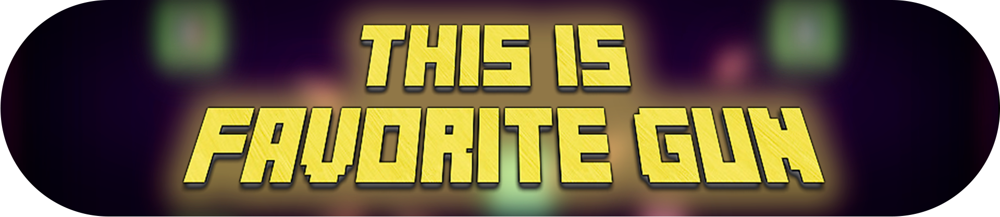

# 🎮 This is favorite gun

 

  
  Изначально разработано как курсовая работа по мобильной разработке

## 🌟 Особенности
- **🎲 Случайная генерация уровней** — Каждый заход уникален!
- **🔫 Динамичная система оружия** — Меняйте оружие на лету.
- **👾 Эпичные битвы с боссами** — Уникальные способности и награды.
- **🛍️ Магазин косметики** — Кастомизируйте своего персонажа.
- **📱 Кроссплатформенность** — Играйте на Android, ПК (Windows/Linux/macOS).
- **🌈 Неоновая эстетика** — Минимализм и приятная глазу палитра.

  

## 🕹️ Геймплей
- **Управление**: 
  - **Мобильные устройства**: Джойстики для движения и стрельбы + интуитивные кнопки.
  
- **💻 ПК (Клавиатура + Мышь)**  

|    Клавиша     |                Действие                | |
|----------------|----------------------------------------|------------------|
| `W`, `A`, `S`, `D` | Перемещение персонажа              | 🏃   |
| `ЛКМ` / `Space` | Стрельба / Активация оружия        | 🔥     |
| `Q`            | Быстрая смена оружия (цикл через слоты)| 🔄     |
| `E`            | Подобрать предмет / Открыть дверь к боссу | 🚪💀  |

- **Механики**:
  - Исследуйте комнаты с врагами, аптечками и секретами.
  - Зарабатывайте монеты для покупки косметики.
  - Выживайте как можно дольше — ваше здоровье не восстанавливается автоматически!

## ⚙️ Установка
### Мобильные устройства (Android):
1. Скачайте [APK-файл](https://github.com/yourusername/primitive-neon/releases/latest).
2. Установите и запустите!

### ПК (Windows/Linux/macOS):
1. Перейдите в [релизы](https://github.com/yourusername/primitive-neon/releases).
2. Выберите версию для вашей ОС.
3. Скачайте, распакуйте и запустите `This is favorite gun`.

## 🛠 Технологии
- **Движок**: Unity 2021.3
- **Язык**: C#

## 📖 О проекте
**This is Favorite Gun** — это динамичная игра в жанре roguelike, созданная как курсовой проект для изучения **Unity** и **C#**. За 48 часов разработки во время локального **game jam**🎉 проект получил яркий визуальный стиль, который можно описать как *"примитивный неон"*, и захватывающий геймплей.

## 📄 Лицензия
MIT License — Подробнее в файле [LICENSE](LICENSE).
